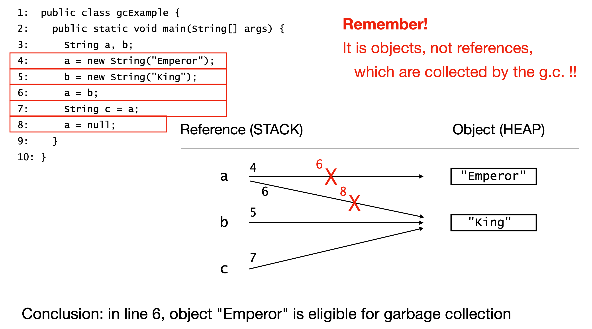

# JVM

## Garbage Collection

- all obejcts are stored in memory called heap
- autometically free up memory when objects are no longer rechable in the program
    - object has no reference pointing to it
    - all references have gone out of scope
- No control on when gc will remove the eligible object from heap
- System.gc() suggest gc to clean the heap, but not guranteed
  
- How Stack and heap are working together
- Complete program parsing, compiled bytecode, runtime execution, memory space (stack and heap), pools, thread management and execution

|  |
|:-----------------------------------------------------------------------------------------:|
| *Figure 1: Example of Java Garbage Collection*                                                 |

