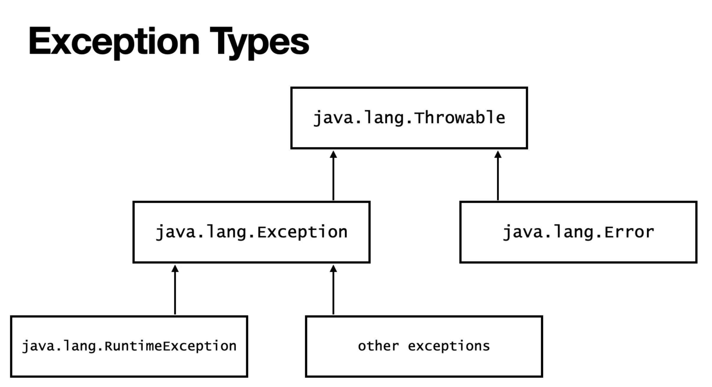

# Exceptions

## handling Exception

Exceptions are caused by user error, programmer error, or physical resource issues. A try/catch block is placed around the code that might generate an exception.  The Exception type can be used to catch all possible exceptions. If an exception is created using thorws, this exception must be managed in the caller program using try/catch block. A single try block can contain multiple catch blocks that handle different exceptions separately. 'finally' is added after 'try' and 'catch' to execute some code whether the exception happened or not.

|  |
|:-----------------------------------------------------------------------------------------:|
| *Figure 1: Exception Types in java*                                                 |

Checked exception: Can be determined at compile time. Must be decalred or handled by the code. Example: all exception except RuntimeException - IOException
    - Decalred using 'throws' keyword
    - Handled using try-catch block
Unchecked exception: Can only determined at runtime. Example: java.lang.Error, java.lang.RuntimeException, ArithmeticException, NullPointerException, ClassCastException

Manual exception can be trown using 'throw' keyword

```java

//dclare exception
void firstByteFromFile(File filename) throws IOException {
    FileInputStream file = new FileInputStream(filename);
    byte x = (byte) file.read();
}

//throw exception
if(x > 5) throw new IllegalArgumentException();

//handle excepption
public class MyClass {
    public static void main(String[ ] args) {
        try {
            int a[ ] = new int[2];
            System.out.println(a[5]);
        } catch (Exception e) { //can catch multiple exception but catch subclass before parent class - "IOException | NumberFormatExcpetion e"
            System.out.println("An error occurred");
        }
        finally {
            System.out.println ("I can run no matter what");
        }
    }
}

//custom exception
public class CustomException extends Exception{
    public CustomException(String message){super(message)};
}
```

## Try with Resources

Ease for dealing with resources, especially closing the resources are autometically handled to prevent resource leak

```java
try(FileInputStream is = new FileInputStream("myfile.txt")) { //opening the resource, you can open multiple resources with ";"
    //read the file
} catch (IOException e) {
    e.printStackTrace();
}
//no need finally block, the resource closed autometically
```

The only consition to use a class inside try is that it needs to implement AutoClosable

```java
public class myFileClass implements AutoClosable {
    @Override
    public void close(){ //closing the resource here, this method also can throw exception
        System.out.println("Closing myFileClass"); 
    }
}
```